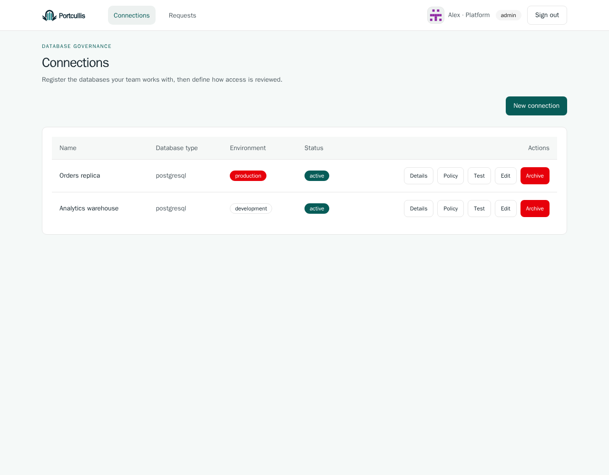
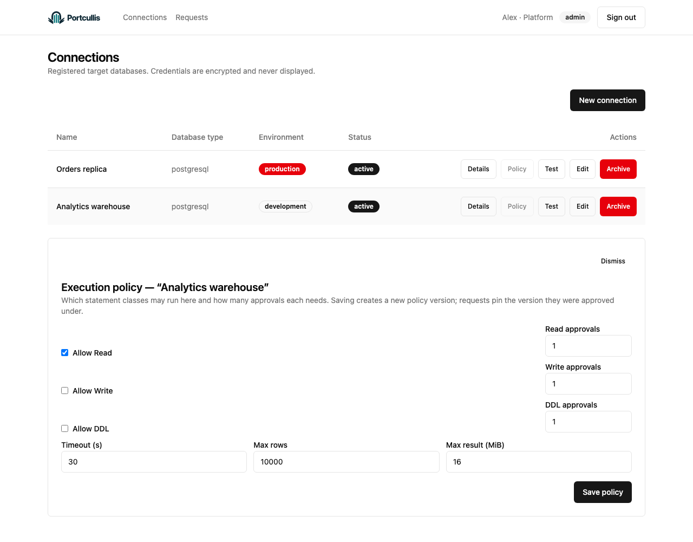
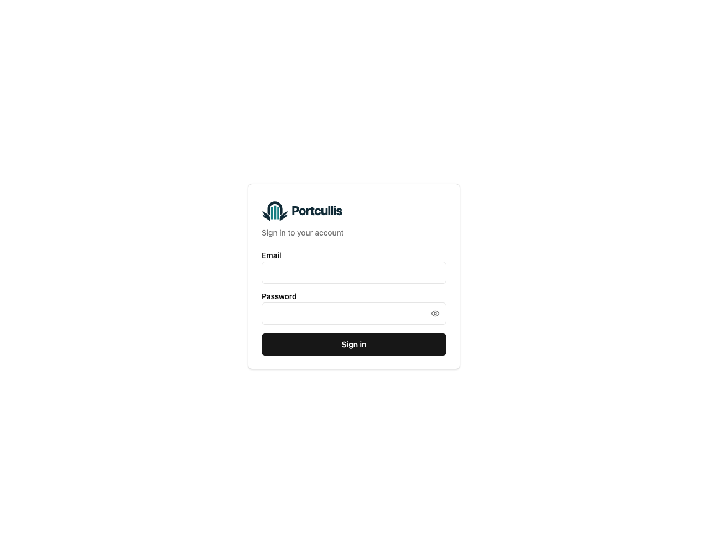
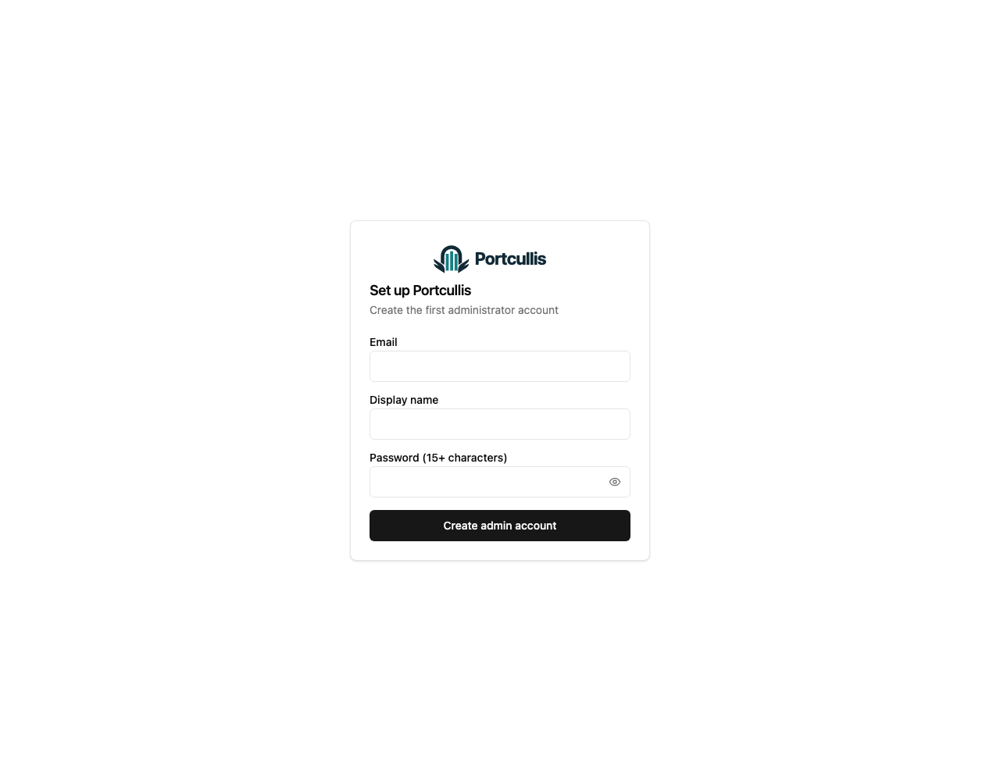

# Portcullis


Self-hosted database governance and result exploration. Control access and changes, review SQL before execution, and explore the results in one application. Portcullis ships as a Go binary with an embedded SolidJS web interface.

**PostgreSQL alpha — M1 verification passed.** These screenshots show the real application with synthetic data. The full gate includes actual CSV file saving and readback using Docker-hosted Chromium. See the [validation record](docs/operations/m1-validation.md) for the tested environment and qualification limits.

## Request, review, execute once

Compose SQL on a dedicated request page with room for the statement and typed parameters. SQL auto-formats when you leave the editor; you can turn it off, format manually, or undo the formatting. Save a draft to continue editing, or submit it for approval. Submission freezes the request payload and policy version. A distinct reviewer inspects the request, then the original requester executes it once. An executed request cannot be replayed.


Alex is the requester; Sam is the reviewer. The demo reviewer is provisioned through a database fixture. User-management screens are not yet available.

## Explore results

Browse pages, sort numeric columns, filter values, and inspect full cells. Large integers and decimals retain their precision, and columns display both their logical and database types.


CSV preparation uses the entire cached snapshot, independently of the current page or filter. The walkthrough stops at the prepared download link; it does not demonstrate successful native file saving. Cached results expire after 15 minutes and may be evicted earlier under quota pressure.

## Database support

PostgreSQL is verified in the development alpha. MySQL is the next committed target; its product adapter is not available yet. SQLite is excluded. See the [DB-by-feature support matrix](docs/product/database-support.md) for available features, planned work, version evidence and additional SQL candidates.

## Features

| Feature | Available in the development build |
| --- | --- |
| Connection management | Register and test PostgreSQL targets, label development/production environments, and archive connections |
| Per-connection policies | Allow Read / Write / DDL, set approval quorums, and limit execution time, rows, and result bytes |
| Requests and approvals | Editable drafts, frozen submissions, distinct reviewers, approval, rejection, and cancellation |
| Governed execution | Revalidate approvals and policies, execute once, request cancellation, and explicitly report uncertain outcomes |
| Result exploration | Encrypted temporary snapshots, pagination, sorting, filtering, full-cell inspection, and CSV preparation |
| Audit and authorization | Server-side permission checks and append-only evidence of state transitions and execution |
| Authentication | First-administrator setup, email/password sign-in, and Google OIDC when configured |

### Connection management

Both connections use an isolated demo database. The `production` label illustrates environment marking; this is not a production database.



### Execution policies

Policy settings open within the connections page. The default policy allows reads and requires one distinct reviewer. An administrator must explicitly enable writes and DDL.



### Request review

Reviewers inspect the submitted SQL, target connection snapshot, and approval status on the request detail page before approving or rejecting with a reason. Requests and results support direct links, reload, and browser history.


### Sign-in and first-run setup

Create the first administrator, then sign in with an email and password. Google sign-in is available when Google OIDC is configured.





## Get started locally

With Docker Compose available, run from the project root:

```sh
docker compose up --build
```

Open `http://localhost:8080`, create the first administrator, and sign in. Register a PostgreSQL connection, check its execution policy, and submit a SQL request. The default policy requires a separately provisioned reviewer. For an isolated single-user demo, set Read approvals to `0`; automatic approval is still audited.

Follow the [PostgreSQL alpha quickstart](docs/operations/pg-alpha-quickstart.md) for connection settings and the first execution. Its owner credentials and disabled TLS are intended for disposable local demonstrations.

## Documentation

[Documentation index](docs/README.md) · [Roadmap](docs/roadmap.md) · [Product requirements](docs/product/prd.en.md) · [Architecture](docs/ARCHITECTURE.md) · [Development guide](docs/development.md) · [Branding](docs/branding.md) · [Refreshing screenshots and GIFs](docs/media/README.md)
