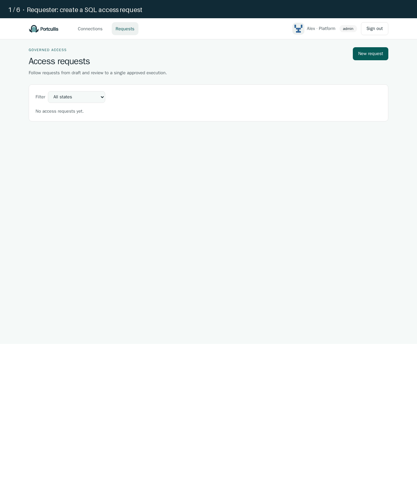
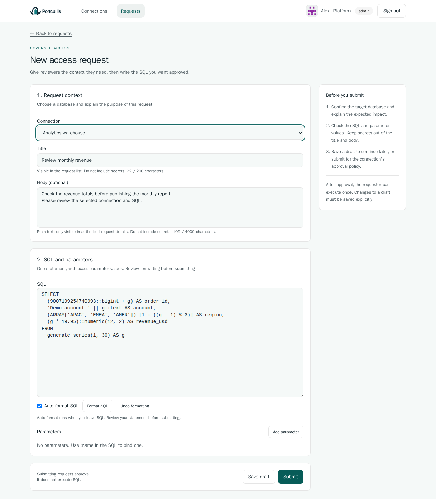
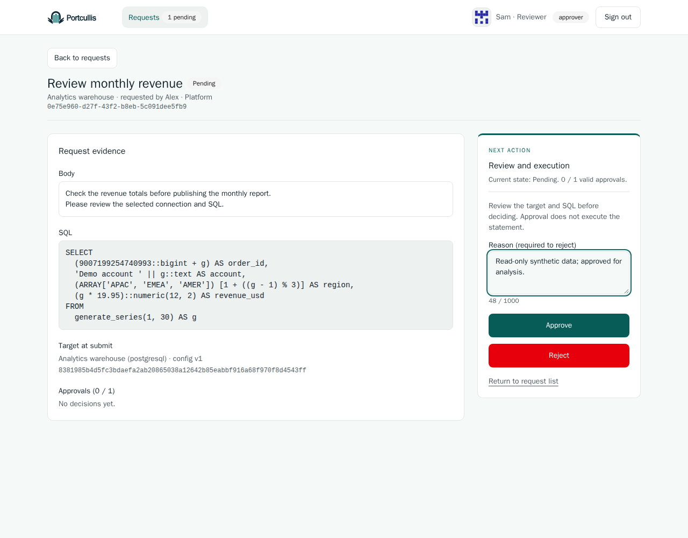
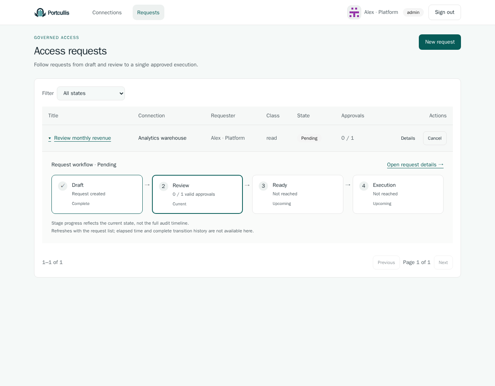
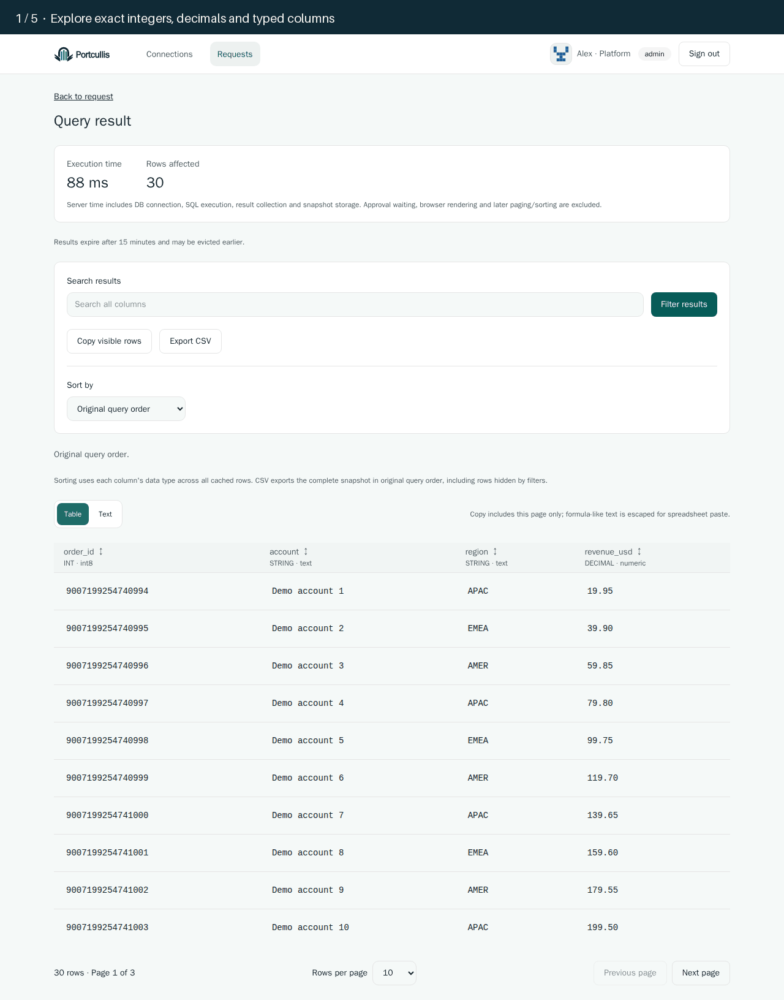
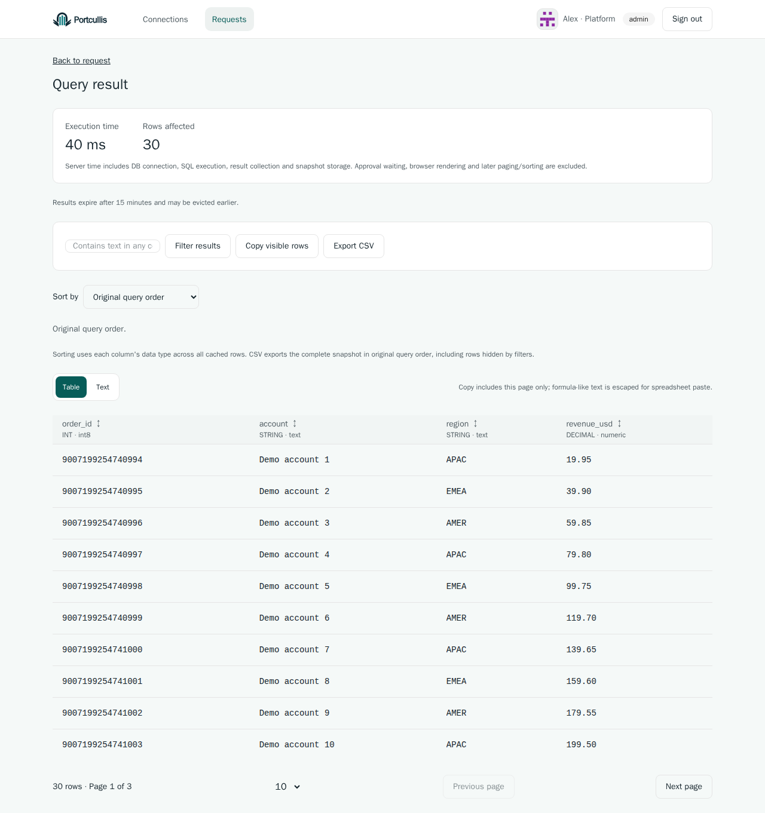
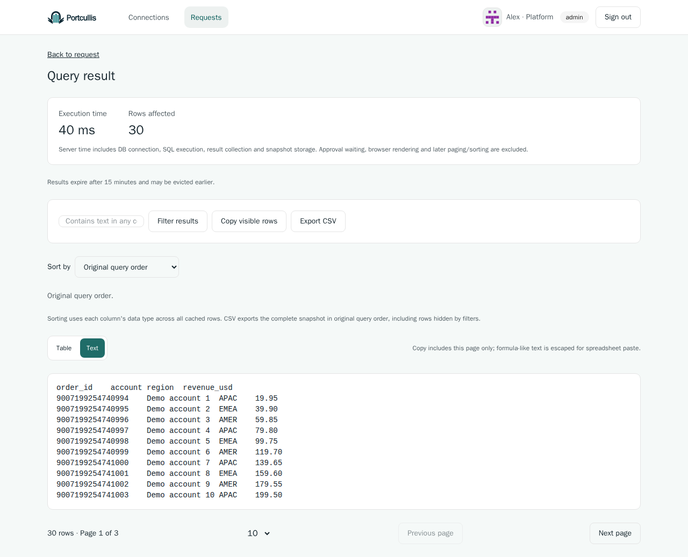

# Portcullis


**Self-hosted database governance. Request, review, execute once, and explore results.**

[](LICENSE)
[](https://github.com/aportcullis/portcullis/actions/workflows/ci.yml)

[Quickstart](#getting-started) · [Demo](#see-it-in-action) · [Docs](#documentation) · [Changelog](CHANGELOG.md) · [Community](#community) · [Contribute](#contributing)

Portcullis brings SQL requests, approval, execution, and audit into one application. Review the exact SQL and parameters, apply connection policies, and explore an approved execution's results in your own infrastructure. One Go binary includes the web UI; PostgreSQL stores metadata.

**Development alpha:** the PostgreSQL governance workflow has passing evidence; M1 user/role administration and release safeguards are still in progress. The full MVP follows later milestones. Check the [database support matrix](docs/product/database-support.md) and [validation record](docs/milestones/m1/validation.md) before adopting it.

## What you can do

- **Govern access:** configure Read / Write / DDL permissions, reviewer quorums, and execution limits per connection.
- **Review with context:** compose a title, body, SQL, and typed parameters; follow progress inline and review frozen submissions.
- **Execute once:** revalidate approvals and policies, then report the outcome without automatically replaying uncertain executions.
- **Explore results:** sort by column, filter, inspect cells, switch Table/Text views, copy visible rows, or export CSV without rerunning SQL.

<details>
<summary>Security and self-hosting details</summary>

Authorization is enforced on the server. Credentials and request payloads are encrypted; encrypted result snapshots expire, and audit records are append-only. Connection policies bound execution time, row count, and result size.

Run with Docker Compose and the embedded web UI. Local authentication is included; Google OIDC is optional. See the [architecture](docs/ARCHITECTURE.md) and [operations quickstart](docs/operations/pg-alpha-quickstart.md) for boundaries and operating requirements.

</details>

## Getting started

Install Git and Docker with Docker Compose, then run:

```sh
git clone https://github.com/aportcullis/portcullis.git
cd portcullis
docker compose up --build
```

Open [localhost:8080](http://localhost:8080), create the first administrator with the one-time setup token printed by `docker compose logs portcullis`, and follow the [PostgreSQL quickstart](docs/operations/pg-alpha-quickstart.md) to register a target and submit your first request.

For production, use the [recommended private-network architecture](docs/operations/recommended-architecture.md): keep Portcullis inside your network and connect through Cloudflare WARP or Tailscale.

<details>
<summary>Local demo settings and persistence</summary>

The default policy requires one distinct reviewer. For a disposable single-user demo, set **Read approvals** to `0`.

Compose preserves metadata and master keys in volumes. Sample credentials and disabled database TLS are for local demonstrations. Consult the quickstart for operating requirements, backup considerations, and execution limitations.

</details>

## See it in action

Submit SQL with context → get a distinct review → execute once → explore the result. These captures show the actual application with synthetic data.

<details>
<summary>Request and review — walkthrough, composition, and approval controls</summary>



Request context and SQL have separate sections. Reviewers inspect the evidence beside a dedicated approval panel.





The demo reviewer is fixture-provisioned; user-management screens belong to M1 scope.

</details>

<details>
<summary>Request progress — expand a row to see its workflow</summary>

Click a request title to see Draft → Review → Ready → Execution below the row. Unavailable history and uncertain outcomes are labeled explicitly.



</details>

<details>
<summary>Results — sorting, Table/Text, clipboard copy, and CSV</summary>



Execution summaries show the recorded server duration and affected rows in request details and results. The interval includes DB connection, SQL execution, result collection, and snapshot storage.

Column sorting applies across the cached snapshot and preserves numeric precision. Table/Text and clipboard copy use the current filtered page; CSV exports the complete snapshot in original query order. The walkthrough ends at the prepared download link.





</details>

More screenshots and workflow explanations: [product tour](docs/media/product-tour.md).

## Documentation

| I want to… | Start here |
| --- | --- |
| Try Portcullis | [PostgreSQL quickstart](docs/operations/pg-alpha-quickstart.md) |
| Check database support | [Features and version evidence](docs/product/database-support.md) |
| Understand the system | [Architecture](docs/ARCHITECTURE.md) · [Operations validation](docs/milestones/m1/validation.md) |
| Explore what's next | [Roadmap](docs/milestones/README.md) · [Product requirements](docs/product/prd.en.md) |
| Develop or customize the UI | [Development guide](docs/development.md) · [UI customization](docs/conventions/frontend.md#changing-the-ui) · [Component catalog](web/src/shared/ui/README.md) |

Browse the [documentation index](docs/README.md) for the full reference.

## Community

Try the application, share workflow feedback, or help improve it. [COMMUNITY.md](COMMUNITY.md) explains how to participate. Use [GitHub issues](https://github.com/aportcullis/portcullis/issues) for bugs, questions, and feedback; Discussions setup is not yet verified.

Suspected vulnerabilities belong in the private reporting process described in [SECURITY.md](SECURITY.md), rather than public issues.

## Contributing

Documentation, bug reproductions, tests, and small fixes are welcome. Start with [CONTRIBUTING.md](CONTRIBUTING.md), and discuss substantial changes in an issue before implementation.

## License

[Apache License 2.0](LICENSE). See [NOTICE](NOTICE) for attribution; third-party components retain their own licenses.
