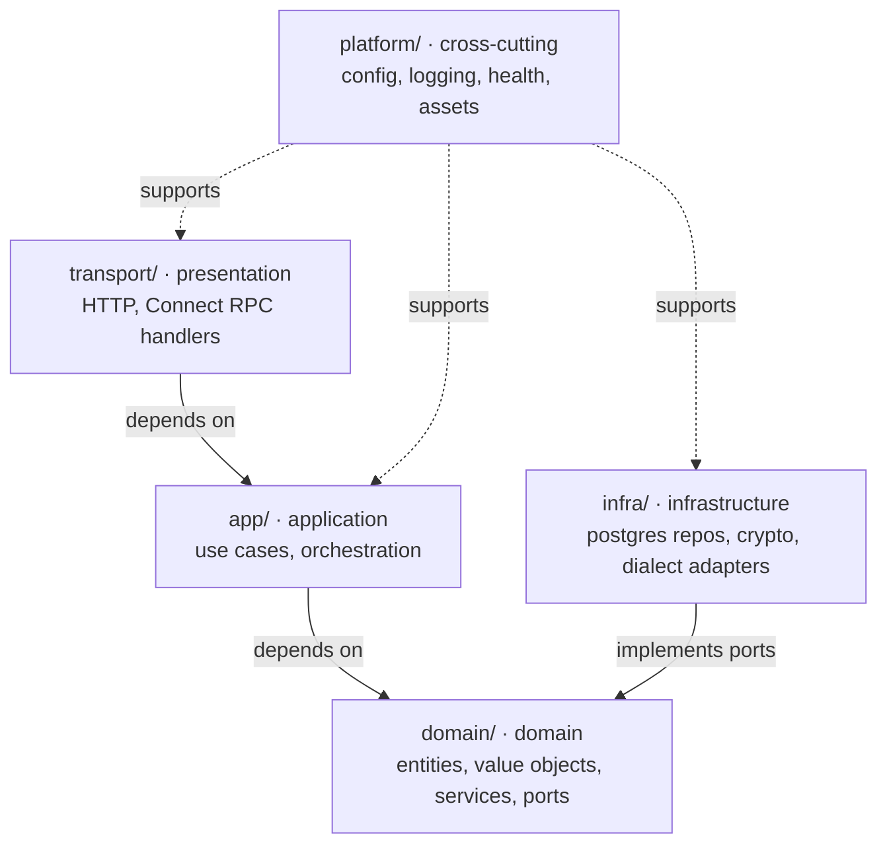

# Architecture

Portcullis is a single Go binary (with the SolidJS frontend embedded via `go:embed`)
organized as a **layered architecture** with DDD boundaries. Source lives under `internal/`.

## Layers

## Dependency rule
- `transport → app → domain`, and `infra → domain` (infra implements domain ports).
- **`domain/` imports nothing outward** — no `app`, `infra`, `transport`, or third-party infra SDKs. Only the standard library and other domain code.
- `platform/` is a leaf usable from any layer; it carries no domain knowledge.
- Dependencies point **inward**: outer layers depend on inner, never the reverse. Ports (interfaces)
  are owned by their consumer: domain-wide persistence contracts live in `domain/`, while narrow
  use-case ports live beside the consumer in `app/`. `infra/` implements both shapes, so inner
  layers stay independent of adapter technology and remain testable.

## Directory map
| Path | Layer | Holds |
|---|---|---|
| `internal/transport/server` | presentation | HTTP server (timeouts/caps per ADR-0010), health endpoints, embedded SPA |
| `internal/transport/connectapi` | presentation | Connect RPC services + interceptors (client IP, rate limit, auth/CSRF) |
| `internal/app/<context>` | application | use-case services orchestrating a bounded context (`auth` today) |
| `internal/domain/<context>` | domain | entities, value objects, domain services, port interfaces (`identity`, `audit` today) |
| `internal/infra/<adapter>` | infrastructure | port implementations: `postgres` (+ generated `db/`, `queries/`), `crypto`; `dialect` arrives with Core 1; `dbtest` (testcontainers helper, tests only) |
| `internal/platform/{config,logging,health,assets,reqmeta}` | cross-cutting | config (viper), structured logging + request-id middleware, k8s health, embedded frontend, request metadata (client IP context) |

Outside `internal/`: `cmd/portcullis` (composition root), `migrations/` (embedded SQL,
applied at startup — `docs/conventions/data.md`), `proto/` + `gen/` (protobuf source and
committed codegen), `web/` (SolidJS SPA), `deploy/` (compose).

## Bounded contexts
Domain contexts today: `identity` (users, sessions, RBAC types), `audit`. The application
service for identity is `app/auth` (the use-case name; one app package can serve a domain
context under a different name). Filled in as features land: `access` (connections, requests,
approvals, executions), `enablement` (saved queries). Schema governance arrives later as its
own context.

## File-organization conventions
Within a package, split declarations by kind into separate files:
- interfaces → `port.go` / `repository.go`
- custom types (structs, enums, value objects, function types) → `types.go` (or one file per significant type)
- constants → `const.go`
- sentinel errors → `errors.go`
- the primary type's constructor/methods/wiring → the package's main file

Tests use the external `package X_test` (black-box).
