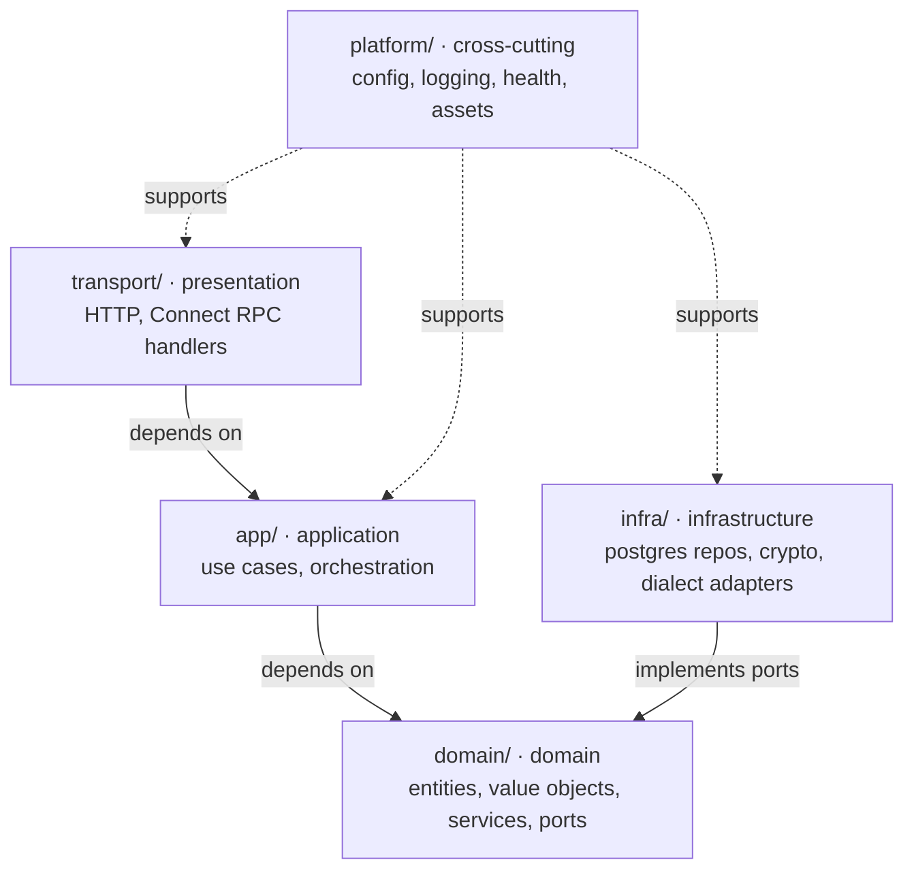

# Architecture

Portcullis is a single Go binary (with the SolidJS frontend embedded via `go:embed`)
organized as a **layered architecture** with DDD boundaries. Source lives under `internal/`.

## Layers

## Dependency rule
- `transport → app → domain`, and `infra → domain` (infra implements domain ports).
- **`domain/` imports nothing outward** — no `app`, `infra`, `transport`, or third-party infra SDKs. Only the standard library and other domain code.
- `platform/` is a leaf usable from any layer; it carries no domain knowledge.
- Dependencies point **inward**: outer layers depend on inner, never the reverse. Ports (interfaces) are declared in `domain/` and implemented in `infra/`, so the domain stays pure and testable.

## Directory map
| Path | Layer | Holds |
|---|---|---|
| `internal/transport/server` | presentation | HTTP server, health endpoints, embedded SPA; later Connect handlers |
| `internal/app/<context>` | application | use-case services orchestrating a bounded context |
| `internal/domain/<context>` | domain | entities, value objects, domain services, port interfaces |
| `internal/infra/<adapter>` | infrastructure | port implementations: `postgres`, `crypto`, `dialect` |
| `internal/platform/{config,logging,health,assets}` | cross-cutting | config (viper), structured logging, k8s health, embedded frontend |

## Bounded contexts (domain)
Filled in as features land: `access` (connections, requests, approvals, executions),
`enablement` (saved queries), `identity` (users, sessions), `audit`. Schema governance
arrives later as its own context.

## File-organization conventions
Within a package, split declarations by kind into separate files:
- interfaces → `port.go` / `repository.go`
- custom types (structs, enums, value objects, function types) → `types.go` (or one file per significant type)
- constants → `const.go`
- sentinel errors → `errors.go`
- the primary type's constructor/methods/wiring → the package's main file

Tests use the external `package X_test` (black-box).
