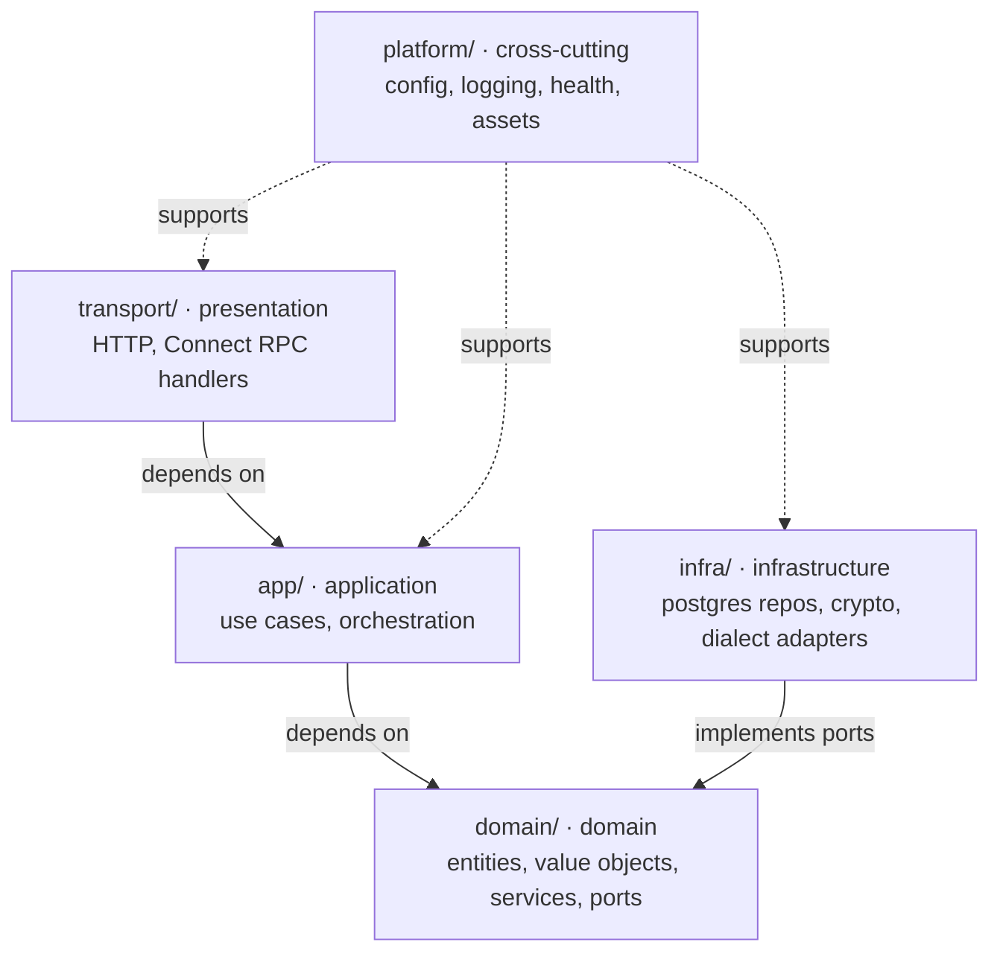

# Architecture

Portcullis is a single Go binary (with the SolidJS frontend embedded via `go:embed`) organized as a **layered architecture** with DDD boundaries.
Source lives under `internal/`.

For the recommended private-network production topology and remote access through Cloudflare WARP or Tailscale, see [Deployment architecture](operations/recommended-architecture.md).

## Layers

## Dependency rule

- `transport → app → domain`, and `infra → domain` (infra implements domain ports).
- **`domain/` imports nothing outward.**
  - No `app`, `infra`, `transport`, or third-party infra SDKs; only standard library and domain code.
- `platform/` is a leaf usable from any layer; it carries no domain knowledge.
  - ADR-0017 exception: `platform/config` and the logging vocabulary test import `internal/domain/setting` so environment seeds and DB settings share validation descriptors.
  - The dependency still points inward and creates no cycle.
- Dependencies point **inward**; consumers own their ports.
  - Domain-wide persistence contracts live in `domain/`; narrow use-case ports live beside their consumer in `app/`.
  - `infra/` implements both, keeping inner layers independent and testable.

## Directory map

| Path | Layer | Holds |
|---|---|---|
| `internal/transport/server` | presentation | HTTP server (timeouts/caps per ADR-0010), health endpoints, embedded SPA |
| `internal/transport/connectapi` | presentation | Connect RPC services + interceptors (client IP, rate limit, auth/CSRF) |
| `internal/app/<context>` | application | use cases for authentication, authorization, auditing, connections, policies, and access requests |
| `internal/domain/<context>` | domain | `identity`, `audit`, `connection`, `access`, `query`, and `setting` models and contracts |
| `internal/infra/<adapter>` | infrastructure | `postgres` repositories and generated SQL, `crypto`, `pgdialect`, `googleoidc`, and test adapters |
| `internal/platform/{config,logging,health,assets,reqmeta}` | cross-cutting | config (viper), structured logging + request-id middleware, k8s health, embedded frontend, request metadata (client IP context) |

Outside `internal/`: `cmd/portcullis` (composition root), `migrations/` (embedded SQL, applied in migration mode or opted-in startup), `proto/` + `gen/` (protobuf source and committed codegen), `web/` (SolidJS SPA), `compose.yaml`, and `deploy/` (PostgreSQL initialization).

## Bounded contexts
Current domain models cover identity, audit, connections and policies, access requests and approvals, query contracts, and runtime settings.
The application service for identity is `app/auth` (the use-case name; one app package can serve a domain context under a different name).
Access requests include draft submission, policy and target snapshots, and approval decisions; the execution service remains planned.
Query dialect execution exists as an adapter, while governed execution, result storage, and query assets still need their application services.
The runtime-setting registry and precedence model exist; the DB settings service, refresh mechanism, and admin UI remain planned.
BI charts, dashboards, schema governance, and agent integration follow the PRD roadmap.

## File-organization conventions
Within a package, split declarations by kind into separate files:

- interfaces → `port.go` / `repository.go`
- custom types (structs, enums, value objects, function types) → `types.go` (or one file per significant type)
- constants → `const.go`
- sentinel errors → `errors.go`
- the primary type's constructor/methods/wiring → the package's main file

Tests use the external `package X_test` (black-box).
