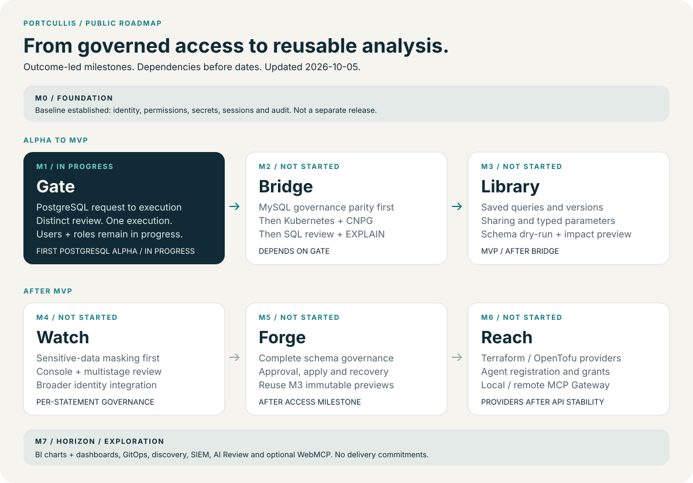

# Portcullis milestones

**Govern access. Build trust. Turn queries into reusable analysis.**

A milestone defines what belongs in the next product release.
Its `scope.md` is the single scope and acceptance baseline; the PRD summarizes the product contract and links to it.
M0 is a shared foundation carried into release checks, while M7 is research without a committed release.
Milestone identifiers are not product versions: only Git tags assign versions.

**Updated: 2026-10-05. M1 is in progress.**
The PostgreSQL governance loop has historical passing evidence; M1 is assessed against its complete scope.
See [M1 progress](m1/progress.md) and [validation evidence](m1/validation.md).

| Milestone | Outcome and scope | Status | Prerequisite |
| --- | --- | --- | --- |
| M0 · Foundation | [Identity, permissions, secrets, sessions and audit](m0/scope.md) | Baseline established | None; checked with later releases |
| M1 · Gate | [PostgreSQL governance and user/role administration](m1/scope.md) | In progress | M0 |
| M2 · Bridge | [MySQL parity → Kubernetes/CNPG → SQL review/EXPLAIN](m2/scope.md) | Not started | M1 |
| M3 · Library | [Reusable query assets and schema preview; completes MVP](m3/scope.md) | Not started | M2 |
| M4 · Watch | [Masking, temporary console, multistage review and identity](m4/scope.md) | Not started | M3; masking precedes agent grants |
| M5 · Forge | [Schema approval, apply, recovery and verification](m5/scope.md) | Not started | M4 and M3 preview contracts |
| M6 · Reach | [Providers and agent registration/MCP Gateway](m6/scope.md) | Not started | M5, M4 masking and stable APIs |
| M7 · Horizon | [Longer-term research candidates](m7/scope.md) | Exploration | Validate each candidate before promotion |

## Managing scope and status

Start new directions as M7 candidates and validate demand, goals, prerequisites and acceptance before promotion.
Update the relevant scope and both PRD translations in the same change, with an ADR for technical decisions.
Ask the owner before starting work outside the current milestone.
Keep scope, progress and validation separate: implementation or one historical gate does not establish milestone completion.
Track execution task lists and review findings only in local working notes, without committing or referencing those notes.
Use `In progress`, `Not started`, `Release ready` and `Released` for delivery milestones, with dated evidence for status changes.
`Release ready` requires every acceptance criterion, `make verify` and `make supply-chain`; only an owner-created Git tag establishes `Released`.

Per [Ethereum's roadmap](https://ethereum.org/roadmap/), named upgrades and longer-term research make delivery intent easier to distinguish.
Per [Kubernetes KEP guidance](https://github.com/kubernetes/enhancements/blob/master/keps/README.md), feature-local records separate scope from tracked delivery state.
Portcullis uses its own release gates and does not adopt either project's schedule.
Contributor workflow belongs in the [development guide](../development.md).
