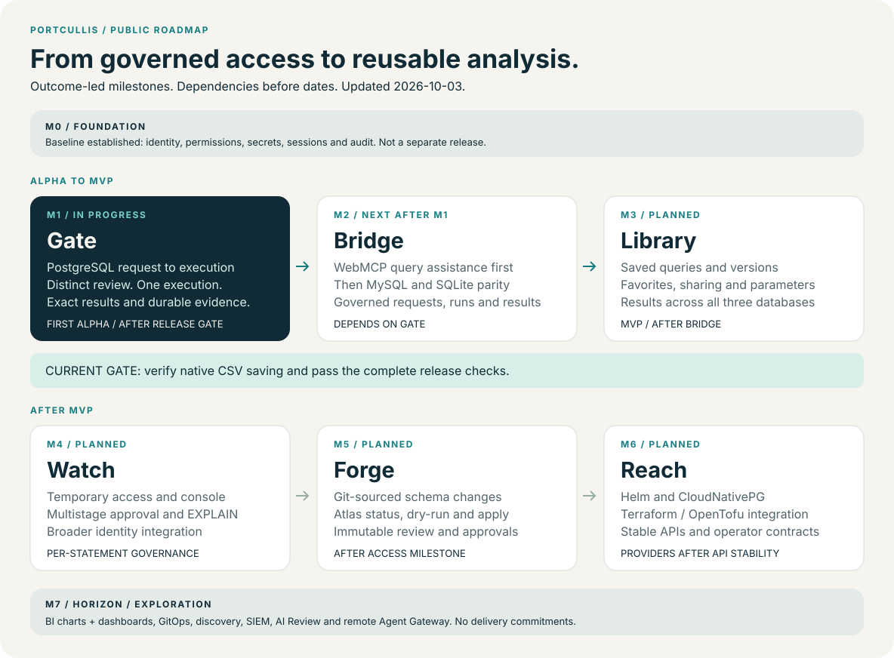

# Portcullis roadmap

**Govern access. Build trust. Turn queries into reusable analysis.**

Portcullis is evolving from a PostgreSQL governance tool into a self-hosted platform for database access, changes, and analysis. This roadmap explains the outcomes we are working toward, how they depend on one another, and what must be true before a milestone is complete.

**Updated: 2026-10-03. Gate (M1) verified; Bridge (M2) is next.** The complete `make verify` gate passed with Docker-hosted Chromium, including native CSV saving and saved-file readback. See the [validation evidence](operations/m1-validation.md) for the tested environment and separate capacity qualification.

## Three directions

| Direction | The outcome we want | Milestones |
| --- | --- | --- |
| Govern | Every access decision and database change has a policy, a reviewer where required, and durable evidence | Foundation, Gate, Bridge, Watch, Forge |
| Reuse | A useful query becomes a repeatable, shareable analysis asset | Bridge, Library, Horizon |
| Operate | Teams can run and integrate Portcullis in their own infrastructure | Foundation, Bridge, Reach, Horizon |

The names below describe product outcomes. The M0–M7 identifiers retain the milestone boundaries in [PRD §11](product/prd.en.md#11-roadmap); they are not a new delivery schedule. The map is a direction of travel rather than a calendar commitment.

## Foundation · M0

**Baseline established — the platform beneath every later milestone.**

Authentication, organization-scoped permissions, encrypted secrets, append-only audit foundations, server sessions, and an embedded web interface give the governance loop a common base. Foundation work is carried into later release checks; it is not a separate product release.

**Evidence:** [Architecture](ARCHITECTURE.md), [authentication and sessions](adr/0006-authentication-and-sessions.md), [RBAC](adr/0008-rbac-roles-and-permissions.md), and [audit integrity](adr/0009-audit-integrity.md).

## Gate · M1

**Verified — first PostgreSQL alpha boundary.**

Give teams one complete path from connection registration through policy, request, distinct review, single-use execution, result exploration, and audit. Preserve exact result values and explicitly report uncertain outcomes without automatically rerunning SQL.

**Acceptance evidence:** The PostgreSQL vertical slice passed the full `make verify` gate: build, vet, lint, all Go tests, 109 frontend tests and all 11 real browser scenarios, including result exploration and native CSV saving/readback. The quickstart describes the first governed execution. See the [M1 validation record](operations/m1-validation.md) for the Docker-hosted browser environment and the undiagnosed host-native saving failure. Performance/soak qualification remains separate.

**Explore:** [Actual workflow and screenshots](../README.md#request-review-execute-once), [alpha quickstart](operations/pg-alpha-quickstart.md), [execution contracts](adr/0021-governed-query-execution.md).

## Bridge · M2

**Next — Gate verification is complete.**

First, add browser WebMCP assistance to the PostgreSQL workflow: discover a connection, compose visible SQL and typed parameters, explicitly save/submit a request, inspect approval state, execute an approved request as its requester, and inspect bounded results. Preserve the same permissions and distinct review; tools do not automatically approve requests. Keep the normal web interface usable in browsers without native WebMCP support.

Then extend the same governance loop to MySQL and SQLite. Users should recognize the same workflow across databases while intentional dialect differences remain visible. Saved-query discovery and reuse follow Library when those assets exist.

**To complete:** Verify the assisted query journey in a real supported browser, including denied/revoked access, cross-user isolation, replay refusal, cancellation, exact/bounded results, and unsupported-browser fallback. Reverify the evolving browser API at implementation time. All three adapters must pass the shared behavior and security contracts. The matrix must document MySQL implicit-commit DDL behavior and SQLite path, symlink, and concurrent-write protections. A new adapter must preserve policy checks, limits, cancellation, audit, and unknown-outcome handling.

**Specification:** [WebMCP query assistance](product/prd.en.md#410-webmcp-query-assistance-m2--bridge), [scope and browser boundary](adr/0024-webmcp-next-milestone.md), [Dialect boundary](product/prd.en.md#53-database-dialect-boundary), [safe execution](product/prd.en.md#82-sql-execution-safety).

## Library · M3

**Planned — completes the MVP after Bridge.**

Turn useful SQL into reusable assets: saved queries, versions, favorites, organization sharing, typed parameters, and execution history. Reusing a query creates a new governed request rather than inheriting an earlier approval.

**To complete:** Saved-query workflows and the result grid must work across all three supported databases under the PRD's ownership, sharing, versioning, and approval rules. Core 2 scope remains subject to the product-validation work in [PRD §1.4](product/prd.en.md#14-problem-validation).

**Release boundary:** Gate is the first PostgreSQL alpha. Library, including Bridge, is the MVP.

## Watch · M4

**Planned — access governance beyond a single request.**

Validate temporary web-console access, multistage approval, EXPLAIN, and broader identity integration sequentially. A session must retain per-statement governance and immediate revocation; it must not become a way around the request policy.

**To advance:** Revalidate demand and the console threat model before implementing each capability. The [temporary-access contract](product/prd.en.md#49-temporary-web-sql-console-threat-model-m4-gate-decided-2026-07-04) defines expiry, concurrency, revocation, transaction boundaries, and audit. Native database proxy access remains a Later candidate.

## Forge · M5

**Planned — governed schema changes.**

Bring Git-sourced migrations into a status → dry-run → review → approve → apply → verify workflow. Use Atlas Community through the defined subprocess boundary and review a pinned, immutable migration artifact.

**To advance:** Validate the engine version, licensing, distribution, and database matrix; preserve immutable review inputs, approval checks, execution recovery, and audit. Optional AI explanations must keep uncertain findings uncertain.

**Specification:** [Atlas boundary](product/prd.en.md#54-atlas-boundary), [schema-governance operating contract](adr/0012-schema-governance-ops.md).

## Reach · M6

**Planned — operating and integrating Portcullis.**

Extend deployment to Helm and CloudNativePG, then provide Terraform/OpenTofu integration after the API is stable. Keep metadata, keys, upgrades, and recovery manageable for self-hosted operators.

**To advance:** Establish API stability and the operational contracts for deployment, backup, upgrades, and accepted result-cache loss before promising provider compatibility. Deployment options do not by themselves imply high availability.

## Horizon · M7

**Exploration — candidates with no delivery commitment.**

Longer-term directions include charts and dashboards, declarative GitOps, CloudNativePG discovery, SIEM integration, ML/AI Review, and a remote/headless Agent Gateway beyond Bridge’s browser WebMCP workflow. They remain candidates until demand, goals, prerequisites, and acceptance criteria are validated. Adding an idea here does not make it an available feature.

## How the roadmap evolves

Start new directions as Horizon candidates. Promote them into a milestone only after validating the problem and updating the PRD and required ADRs. Update both PRD translations when scope changes, and update this overview when milestone status changes. Use passing acceptance evidence to mark completion; do not substitute a percentage or a merged implementation for a release gate.

This presentation takes inspiration from the named upgrades and evolving near-/long-term plans in the [Ethereum roadmap](https://ethereum.org/roadmap/). Portcullis scope and sequencing remain defined by its own PRD. Contributor workflow belongs in the [development guide](development.md).
